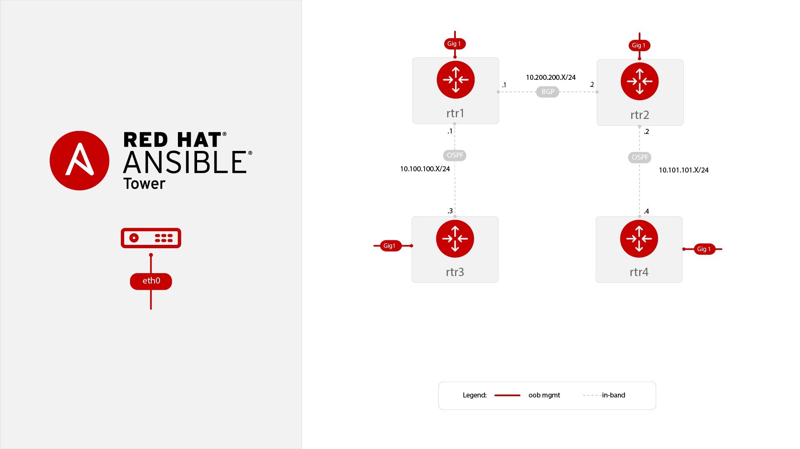

# Estación 4
## Redes y Soporte

### Redes

La Organización requiere que la disponibilidad de la red sea óptima, aún cuando se hagan modificaciones en la operación del día a día.

Como parte del equipo de Redes, es necesario poder tener un respaldo actualizado y disponible de los routers de distintos vendors, pero toma mucho tiempo obtenerlos manualmente y está sujeto a que falten equipos.

Para optimizar el proceso, se requiere configurar en Ansible Tower lo siguiente:

1. Plantilla de trabajo que permita obtener el respaldo de los routers que conforman la red:
## Diagrama de Red



### Tips

Existen varias formas de resolver esta última vuelta, aqui te dejamos algunos tips:


El playbook network_backup.yml del repo realiza la tarea:

https://github.com/network-automation/tower_workshop.git 


En el caso particular de este ambiente, se deben usar 2 credenciales en la plantilla de trabajo: ```Workshop Credential``` y la credencial tipo "Ansible Tower" llamada ```Tower Credential```
Agrega la 2da credencial usando el drop down box al seleccionar las credenciales en la plantilla de trabajo.


Una vez ejecutado el trabajo, verifica que se hayan generado los backups desde una conexión SSH a Ansible Control node


   ```
   [student1@ansible ~]$ ls /backup
   2019-07-09-18-42  2019-07-09-19-18
   ```

### Soporte
La Organización ha solicitado al equipo de Soporte estandarizar las siguientes configuraciones en los equipos de usuario final con S.O. Windows:

1. Usuario "ansible" con privilegios de administrador
2. Instalación de "Telnet-Client"
3. Instalación de IIS Web-Server con management tools
4. Colocar el archivo neerdd.jpg en la ruta c:\Users\Administrator\Downloads
5. Ejecutar el PowerShell script helloworld.ps1
6. Obtener dirección IP del equipo
7. Validar el estatus del win.ini

El equipo de Soporte ya ha desarrollado el playbook ```tower-ansible-automating-windows.yml``` (en este sitio) que ejecuta ciertas tareas, pero les falta agregar las tareas 3 y 4.


Se requiere ejecutar en Ansible Tower una plantilla de trabajo que ejecute los 7 puntos en el grupo "windows" del Inventario.


### Tips


3. Módulo win_feature

4. Módulo win_copy


En Ansible Tower debes agregar la siguiente Credencial para usarla con el grupo "windows" del Inventario

| Key          | Value           |                                          |
|--------------|-----------------|------------------------------------------|
| Name         | Student Account |                                          |
| Organization | Default         |                                          |
| Type         | Machine         |                                          |
| Username     | student#        | **Replace # with your student number**   |
| Password     | *****           | Replace with your student password       |


Ya estas por llegar a la META!!!!
